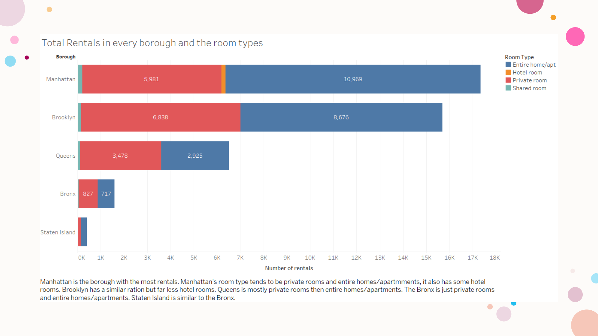
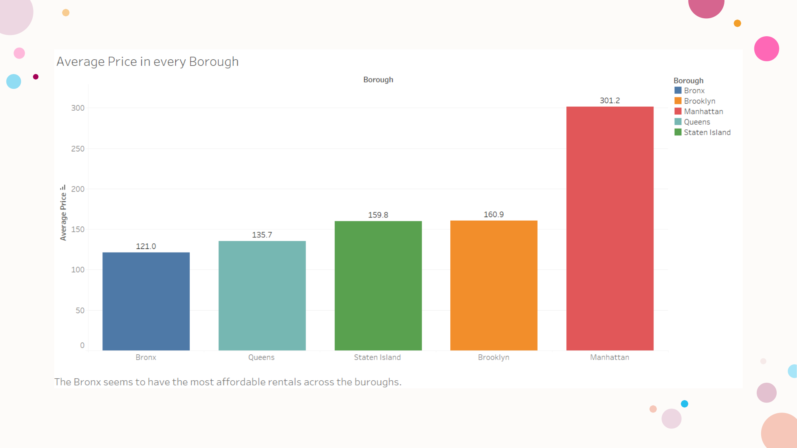
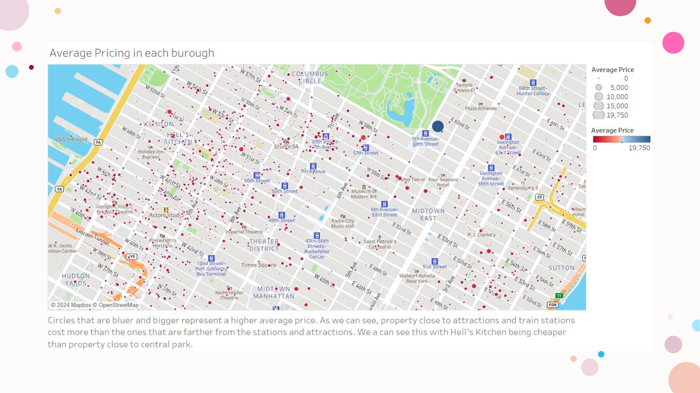
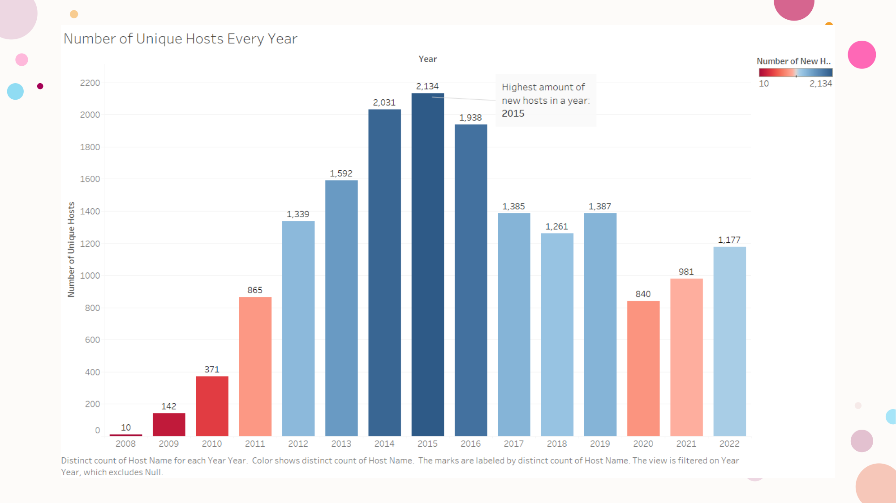

This analysis examines trends in Airbnb data to uncover insights about pricing and room types.

## Rentals by Borough & Room Type

{fig-cap="Rentals by Borough & Room Type."}

## Average Price by Borough

{fig-cap="Average Price by Borough"}

## Spatial Price Distribution (Manhattan Focus)

{fig-cap="Spatial Price Distribution (Manhattan Focus)"}

## Growth of Unique Hosts Over Time

{fig-cap="Growth of Unique Hosts Over Time."}

## Repo / Live

- Code: <https://github.com/ManuelBagasina/AnalysisWorks>

