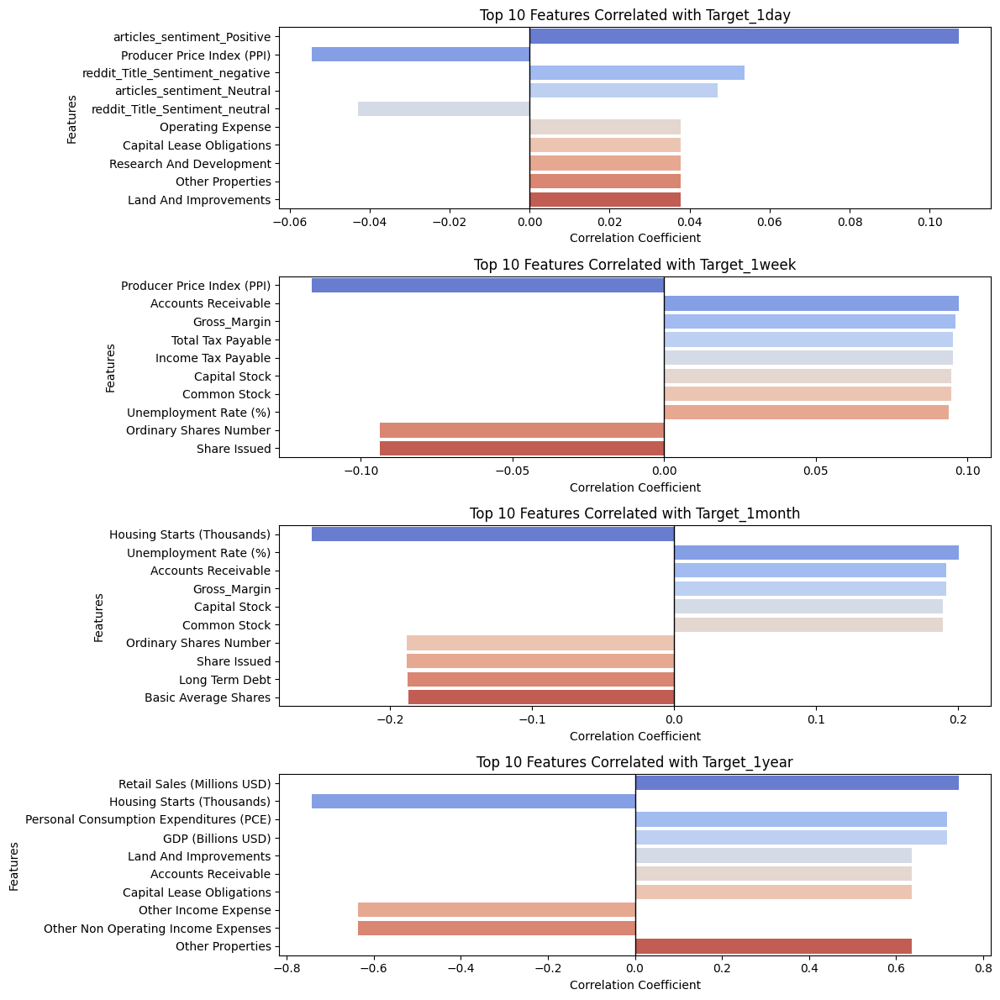
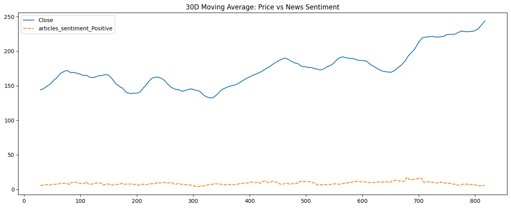
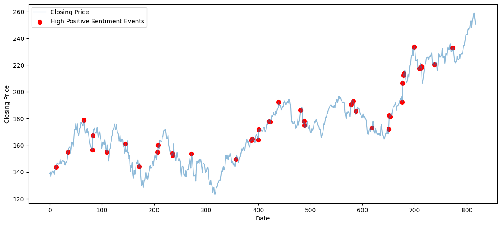
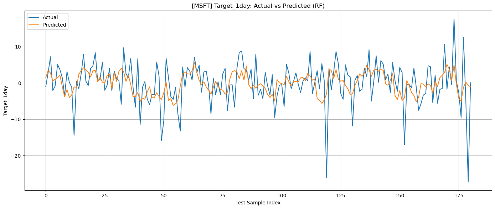
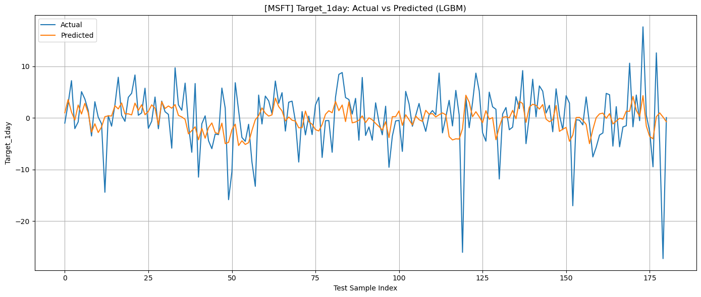
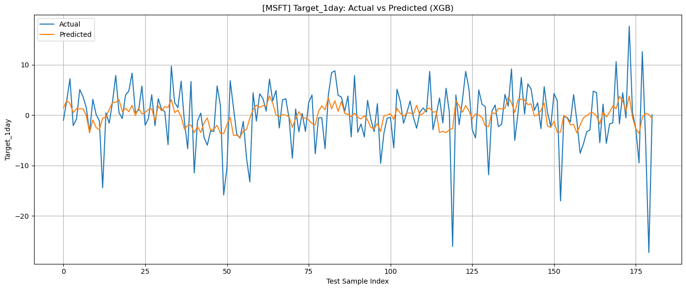
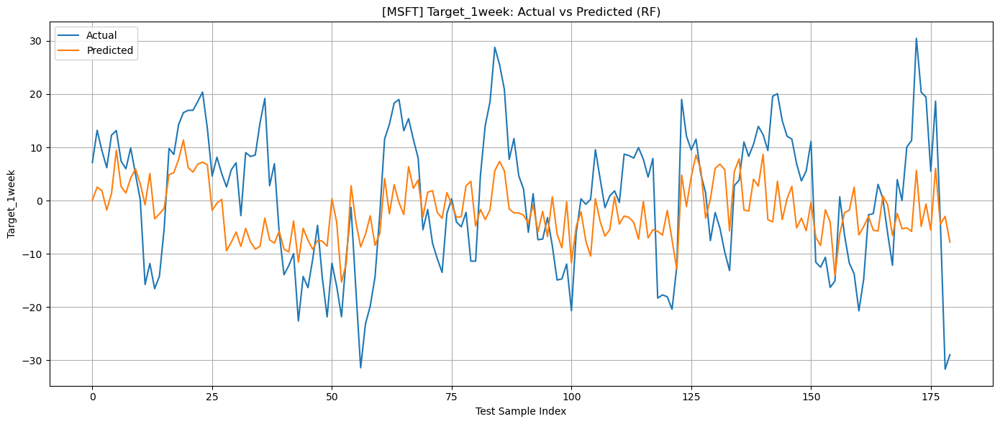
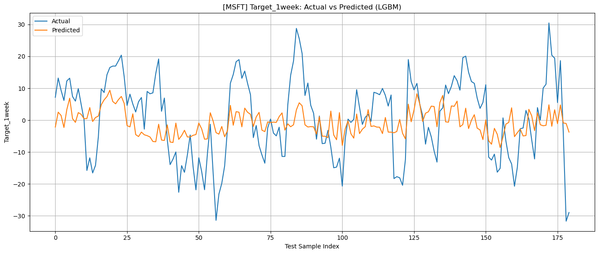
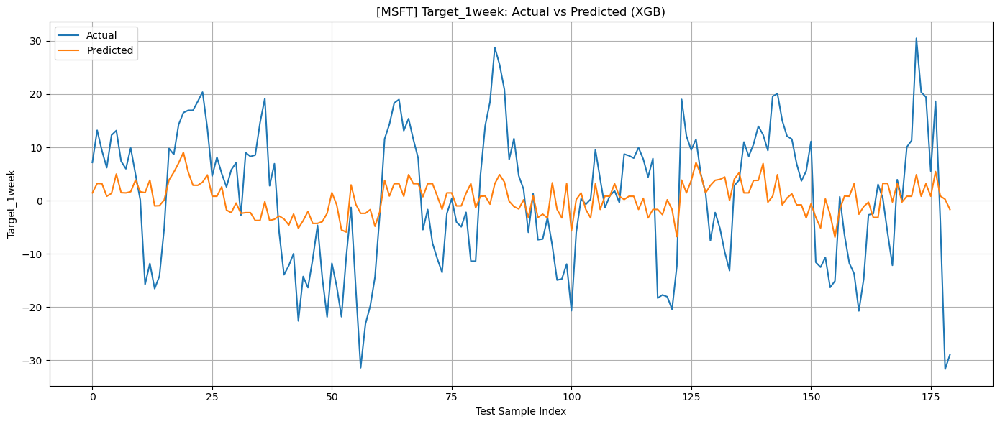

## Problem
Built a forecasting pipeline to predict future metrics for a stock price changes.

## Data
Combined multiple data sources from macroeconomic, microeconomic, historical stock price, and sentiment data. Webscraping and APIs were used to gather these

## Approach
- Cleaned and merged time-series
- Explored patterns and seasonality
- Trained RandomForest, TFT, and LSTM models

## Results
The RandomForest model was the most accurate but not accurate enough when it comes to yearly predictions

## Top Correlations by Horizon

{fig-cap="Top Correlations by Horizon"}

## 30‑Day MA: Price vs Positive News Sentiment

{fig-cap="read_title"}

## High Positive Sentiment Events on Price

{fig-cap="read_title"}

## 1‑Day Ahead: Actual vs Predicted (Random Forest)

{fig-cap="read_title"}

## 1‑Day Ahead: Actual vs Predicted (LightGBM)

{fig-cap="read_title"}

## 1‑Day Ahead: Actual vs Predicted (XGBoost)

{fig-cap="read_title"}

## 1‑Week Ahead: Actual vs Predicted (Random Forest)

{fig-cap="read_title"}

## 1‑Week Ahead: Actual vs Predicted (LightGBM)

{fig-cap="read_title"}

## 1‑Week Ahead: Actual vs Predicted (XGBoost)

{fig-cap="read_title"}

## Repo / Live
- Code: <https://github.com/ManuelBagasina/DATCapstone>

