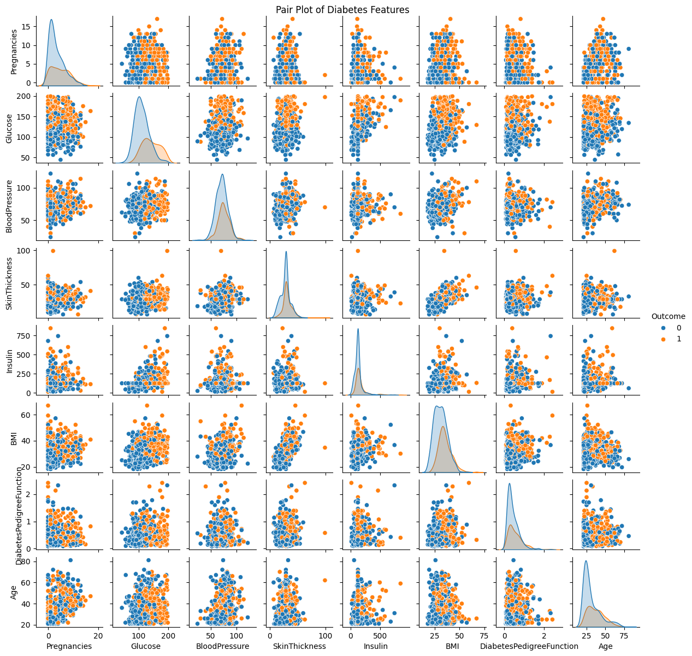
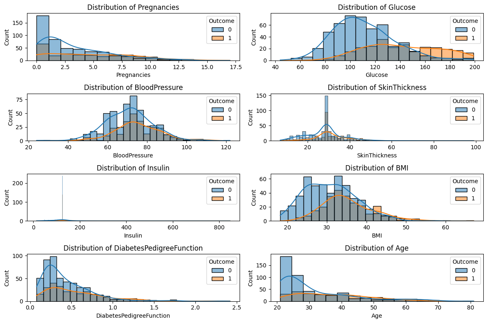
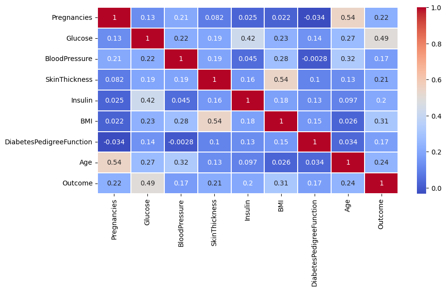
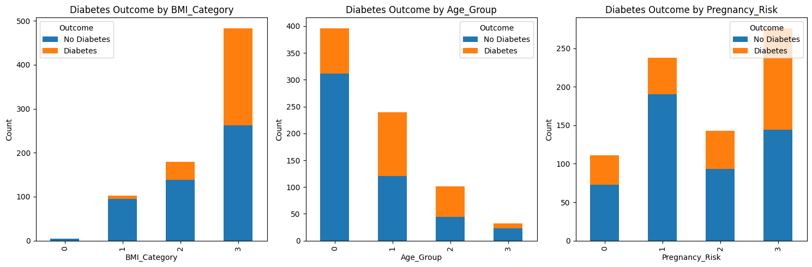
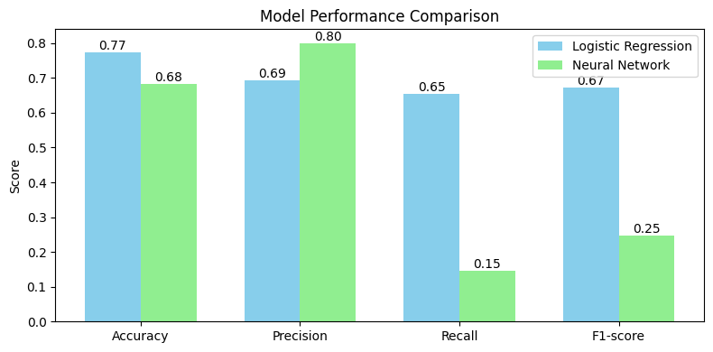
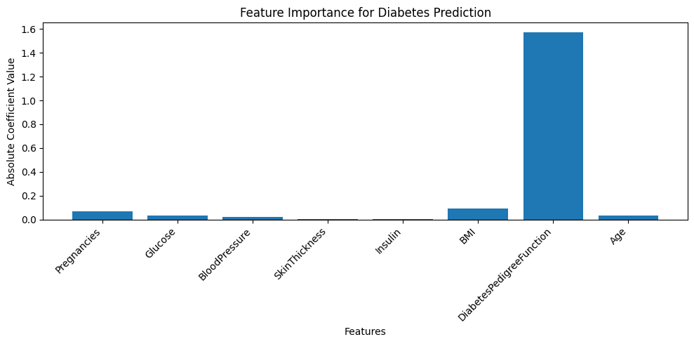
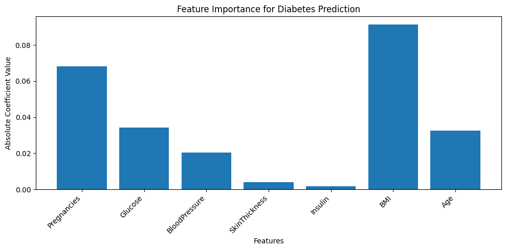

## Problem
Investigated factors associated with diabetes progression to inform preventative care.

## Data
Used the publicly available dataset of patient measurements from the UCI repository.

## Approach
- Cleaned outliers and imputed missing values
- Visualized relationships among clinical variables
- Trained logistic regression and random forest classifiers

## Results
The tuned random forest reached 82% accuracy and highlighted BMI and glucose as key features.

## Pair Plot of Features

{fig-cap="Rentals by Borough & Room Type."}

## Feature Distributions by Outcome

{fig-cap="Rentals by Borough & Room Type."}

## Correlation Heatmap

{fig-cap="Rentals by Borough & Room Type."}

## Outcome by BMI, Age, and Pregnancy Risk

{fig-cap="Rentals by Borough & Room Type."}

## Model Performance Comparison

{fig-cap="Rentals by Borough & Room Type."}

## Logistic Regression Feature Importance

{fig-cap="Rentals by Borough & Room Type."}

## Neural Network Feature Importance

{fig-cap="Rentals by Borough & Room Type."}

## Repo / Live
- Code: <https://github.com/ManuelBagasina/DiabetesML>
