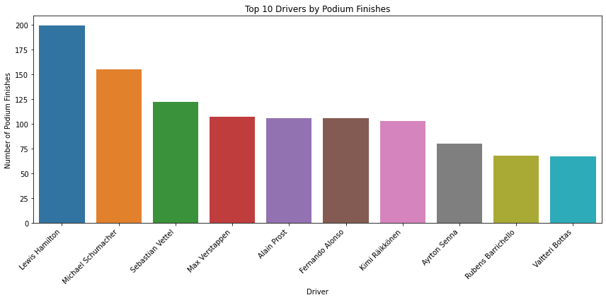
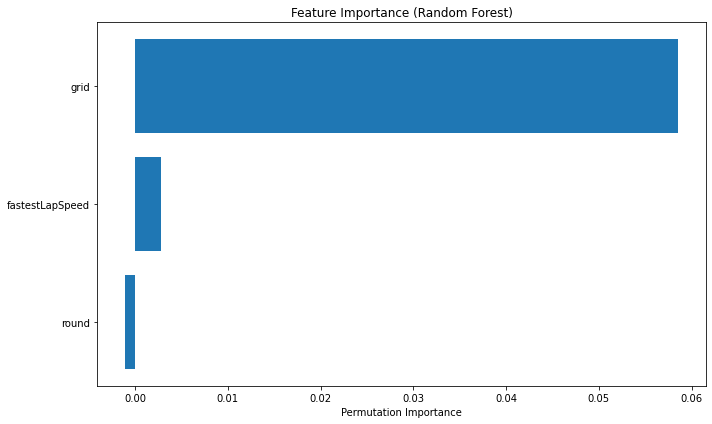
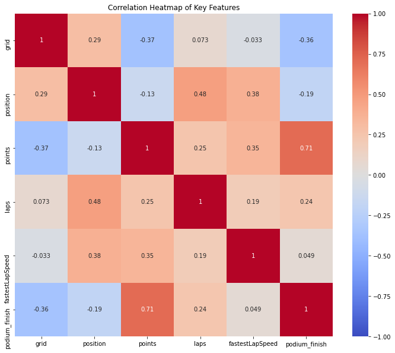
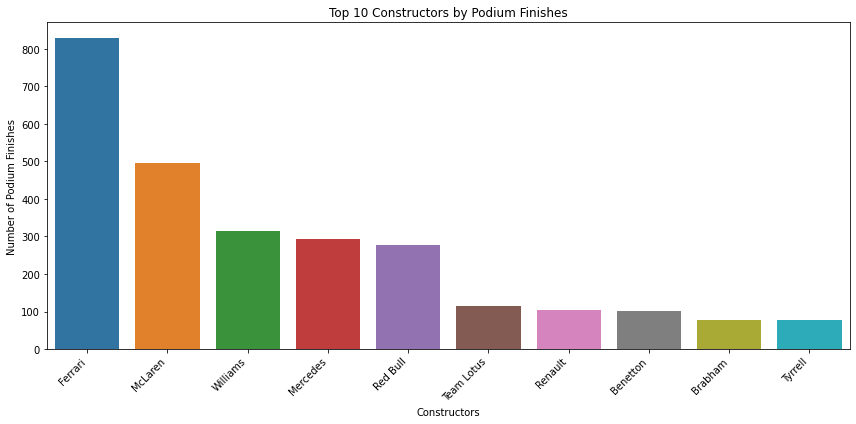
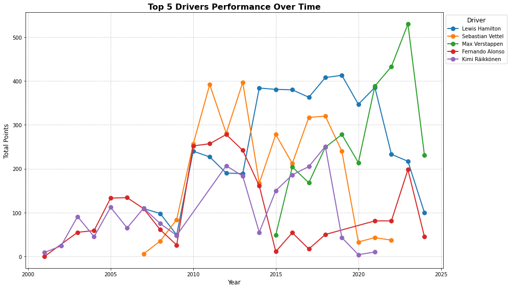

## Problem
Sought patterns in race results to understand which drivers excel on specific circuits.

## Data
Pulled historical results and lap times from the Ergast API.

## Approach
- Aggregated results by driver and track
- Visualized finishing positions and lap pace
- Built a simple model to rank drivers by circuit type

## Results
Revealed that certain midfield drivers consistently outperform on street circuits.

## Visuals

## Top 10 Drivers by Podium Finishes

{fig-cap="read_title"}

## Feature Importance (Random Forest)

{fig-cap="read_title"}

## Correlation Heatmap of Key Features

{fig-cap="read_title"}

## Top 10 Constructors by Podium Finishes

{fig-cap="read_title"}

## Performance of Top 5 Drivers Over Time

{fig-cap="read_title"}

## Repo / Live
- Code: <https://github.com/ManuelBagasina/F1>
