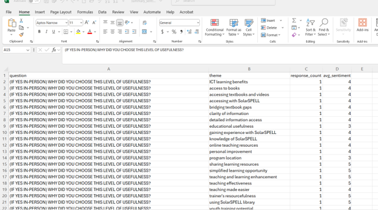
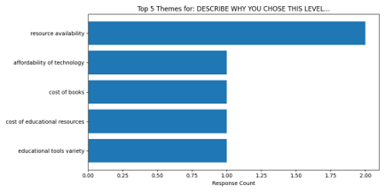
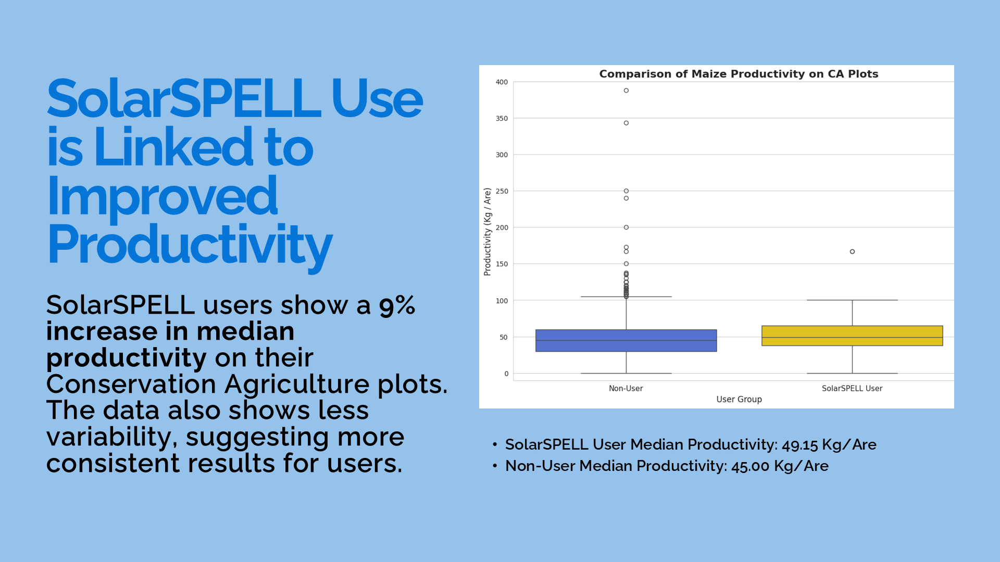
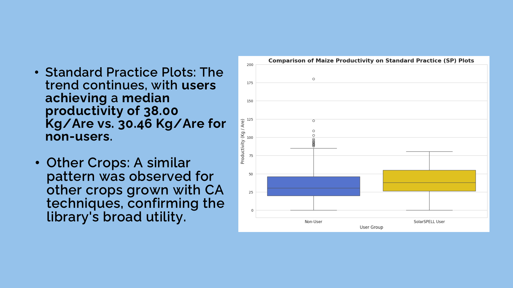
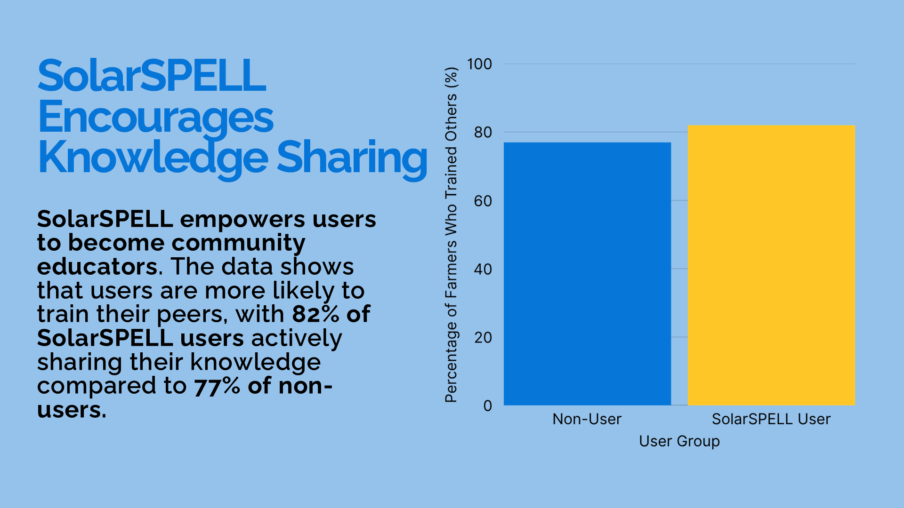
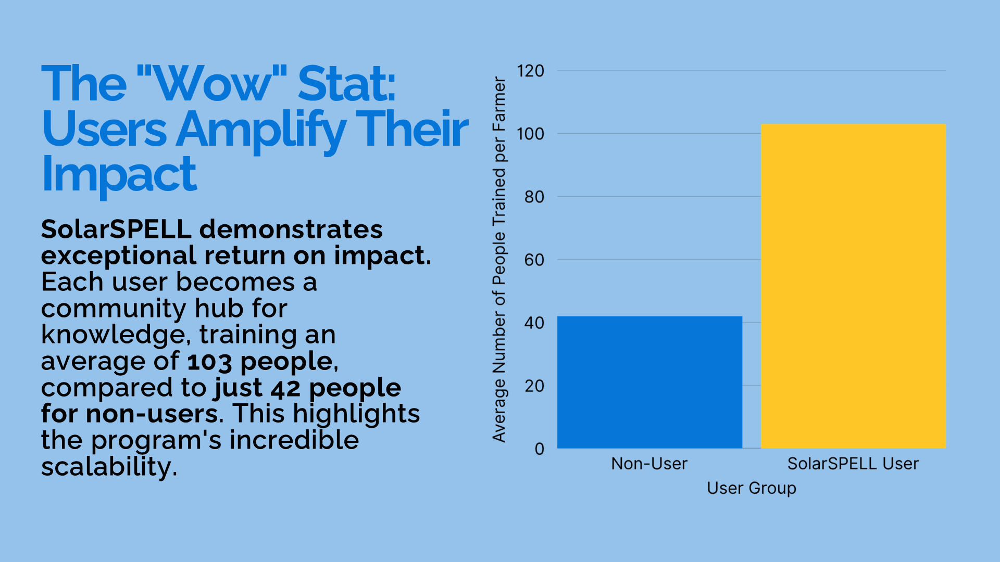
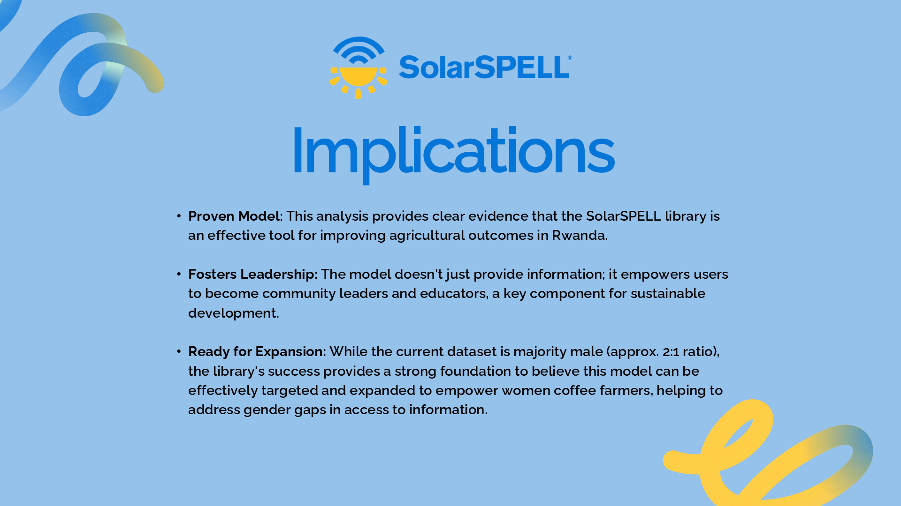

## Problem
SolarSPELL needed a reproducible pipeline to prepare field survey results for analysis.

## Data
Collected responses from multiple countries with varying schemas and encodings.

## Approach
- Normalized column names and coded categorical values
- Loaded cleaned tables into MySQL using SQLAlchemy
- Produced summary dashboards to explore regional trends

## Results
Delivered a reusable ETL script and database that cut data prep time in half.

## Visuals

## Sentiment Analysis results of all free-text responses from a Survey

{fig-cap="read_title"}

## Top Themes from Open-Ended Responses

{fig-cap="read_title"}

## Health-Related Searches in Lesotho

{fig-cap="read_title"}

## CA Plots: Productivity Lift for Users

{fig-cap="read_title"}

## SP Plots: Consistent Gains Across Methods

{fig-cap="read_title"}

## Knowledge Sharing: More Farmers Training Others

{fig-cap="read_title"}

## The “Wow” Stat: Amplified Community Impact

{fig-cap="read_title"}

## Implications & Next Steps

{fig-cap="read_title"}

## Repo / Live
- Code: <https://github.com/ManuelBagasina/solarspell>
